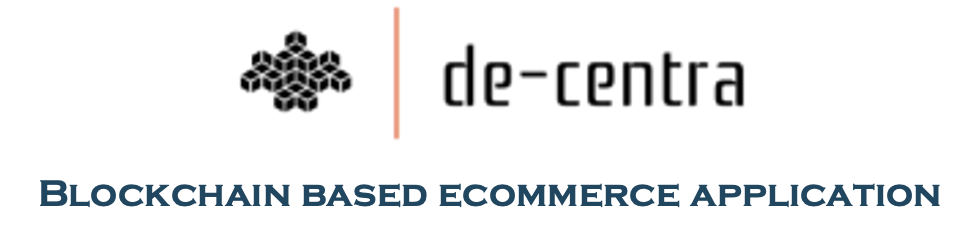

# De-Centra: Blockchain-Based Supply Chain Demo Application 

## Introduction

In today's globalized marketplace, the efficiency and transparency of supply chains are paramount for businesses aiming to maintain a competitive edge. Supply chain management involves the coordination of various interconnected processes, from procurement and production to distribution and delivery, spanning numerous stakeholders. However, traditional supply chain systems often suffer from inefficiencies, lack of transparency, and susceptibility to fraud and errors. 

Enter blockchain technology – a revolutionary solution reshaping the landscape of supply chain management.

Blockchain, originally devised for Bitcoin, has emerged as a game-changer in supply chain management. By leveraging blockchain, participants can establish a secure, immutable, and transparent record of transactions and product movement from raw material sourcing to the end consumer. Each transaction or event in the supply chain is recorded as a block on the blockchain network, creating an indelible chain of custody. 

This distributed ledger ensures that all parties involved have access to the same information in real time, fostering trust and accountability across the supply chain ecosystem. The cryptographic nature of blockchain ensures data integrity, guarding against tampering or unauthorized alterations, enhancing the overall security of the supply chain.

## Key Features

- **Enhanced Traceability:** Provides real-time visibility and verification of product movement.
- **Smart Contracts:** Automates contracts and ensures compliance without intermediaries.
- **Immutable Records:** Data is tamper-proof, reducing fraud risks.
- **Transparency:** Every participant has access to the same ledger, increasing trust.
- **Cost Efficiency:** Streamlines processes, reducing administrative overhead.

## Use Case: E-commerce Supply Chain on Blockchain

The demo application, `de-centra`, exhibits a compelling integration of blockchain technology, particularly through the utilization of smart contracts, to facilitate various operations within the supply chain ecosystem.

At its core, the application functions as a platform akin to an e-commerce website where producers can create and register products (items) for sale, and buyers can subsequently purchase these items. What distinguishes this platform is the underlying blockchain infrastructure, which orchestrates the entire supply chain process transparently and autonomously.

### Key Operations

1. **Product Creation**: Producers register items with key attributes (name, price, category, condition), which are encoded into smart contracts. This ensures immutable and transparent records on the blockchain.
  
2. **Purchase and Dispatch**: Once an item is sold, the producer initiates the dispatch process, which updates the item's state on the blockchain to "dispatched." This state transition creates an auditable trail of the product's movement.
  
3. **Real-Time Tracking**: Users can track the status of items as they traverse the supply chain, enhancing transparency and reducing risks associated with counterfeit products, unethical sourcing, and supply chain disruptions.

## Future Expansion

While `de-centra` currently demonstrates a simple use case, it is built on a scalable foundation that can be expanded to include additional supply chain stages, such as:

- **Quality Control Checkpoints**
- **Inventory Management**
- **Logistics Optimization**
- **Sustainability Tracking**

Integration with other technologies, such as IoT devices and AI, can further enhance real-time monitoring and predictive analytics capabilities.

## Getting Started

### Prerequisites

- Node.js
- Truffle Framework
- Ganache (for local Ethereum blockchain testing)
- Metamask (for browser wallet integration)

### Installation

1. Clone the repository:
    ```bash
    git clone https://github.com/yourusername/de-centra.git
    cd de-centra
    ```

2. Install dependencies:
    ```bash
    npm install
    ```

3. Run the application locally:
    ```bash
    npm start
    ```

### Smart Contract Deployment

To deploy the smart contracts on a local blockchain (Ganache), follow these steps:

1. Compile the contracts:
    ```bash
    truffle compile
    ```

2. Deploy the contracts:
    ```bash
    truffle migrate
    ```

### Running Tests

To test the smart contracts:

```bash
truffle test

## Global Environment
------------------
➜  project npm ll
eth@
│ /Users/vinit/Dcu-workspace/eth
│ 
├── @openzeppelin/contracts@5.0.1
│   
├── node@18.0.0
│   
└── web3@4.5.0
    

➜  project npm ll -g
/Users/vinit/.nvm/versions/node/v20.11.1/lib
│ 
├── @openzeppelin/contracts@5.0.1
│   Secure Smart Contract library for Solidity
├── corepack@0.23.0
│   
├── npm@10.2.4
│   a package manager for JavaScript
└── truffle@5.11.5
    Truffle - Simple development framework for Ethereum


Project env
-----------
supply-chain-demo@1.0.0 /Users/vinit/Dcu-workspace/eth/codebase/project/supply-chain-demo
├── @openzeppelin/contracts@4.0.0
├── lite-server@2.6.1
└── web3-utils@4.2.0

## Commands
--------
Launch Ganache Blockchain
Connect your metamask to the local chain

Install node
> brew install node@18

Install Truffle
> npm install -g truffle

Install openzepplin dependency
> npm install @openzeppelin/contracts@4.0.0


Cleanup and deplyment of contracts
> rm -rf build
> truffle migrate

To run contracts UTs
> truffle test

Start server
> npm run dev
